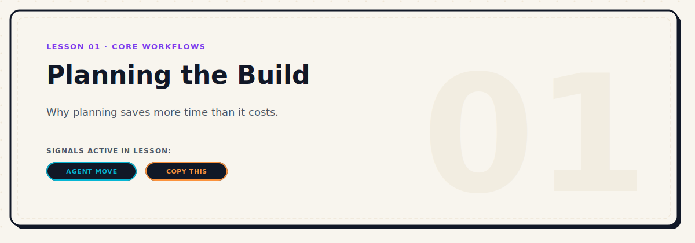
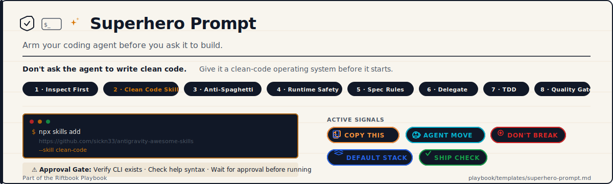

# Markdown Patterns

Riftbook enforces strict Markdown patterns for layout styling and content flow. Future agents must follow these patterns exactly.

---

## 1. Lesson Intro
- **Pattern:** Every lesson begins with the Lesson Hero card, a blank line, a single-sentence blockquote promise, a blank line, the Metadata Table, a blank line, the Active Signals block, and a divider.
- **Example:**
  ```markdown
  

  > **Make a plan before you write code, so your agent knows when it is done.**

  | Level | Duration | Path | Prerequisites | Tools Mentioned |
  |---|---|---|---|---|
  | Beginner | 5 mins | Start Here | None | Claude Code |

  ### Active Signals in this Lesson
  -  · 

  ---
  ```

---

## 2. Personal Mistake Block
- **Pattern:** Use the Purple `MY MISTAKE` badge, followed by a short, first-person confession blockquote detailing the mistake.
- **Example:**
  ```markdown
  

  > **What I did:** I started coding a SQL sync system before creating a basic UI dashboard, wasting two weeks on unneeded database architecture.
  ```

---

## 3. Copy-This Prompt Block
- **Pattern:** Precede copy-ready templates or commands with the `COPY THIS` badge, a blank line, and a fenced markdown block specifying the language or context.
- **Example:**
  ```markdown
  

  ```markdown
  Act as a senior engineer...
  [Prompt text here]
  \```
  ```

---

## 4. Ship Check
- **Pattern:** At the end of lessons, place the `SHIP CHECK` badge, a blank line, a short instructional sentence, a blank line, and a series of checklist boxes.
- **Example:**
  ```markdown
  ## Ship Check

  

  Before proceeding to the next step, verify these criteria:

  - [ ] The build compiles with zero warnings.
  - [ ] All unit tests pass locally.
  ```

---

## 5. Case Study Block
- **Pattern:** Use the `STORY` badge and the standard 5-point layout structure. Refer to [Case Study Layout](./case-study-layout.md) for full structure details.
- **Example:**
  ```markdown
  # Case Study: [Title]

   

  ---

  ## 1. The Project
  [Narrative context]
  ```

---

## 6. Path Card
- **Pattern:** Place a text header defining path profile and length, a horizontal rule, and a learning sequence table.
- **Example:**
  ```markdown
  # Beginner Path

  **Path Profile:** Beginner | **Length:** 6 Lessons

  ---

  | Sequence | Lesson | Why it matters | Status |
  |---|---|---|---|
  | 1 | [From MVP Idea to Spec](../getting-started/01-turn-your-mvp-idea-into-an-agent-ready-spec.md) | setup | Core |
  ```

---

## 7. Legacy Moved Page (Redirect)
- **Pattern:** If a lesson is deprecated or relocated, replace its content with an H1 stating it moved, an warning card or signal, a descriptive paragraph, and a clean markdown link to the new destination.
- **Example:**
  ```markdown
  # This Lesson Has Moved

  

  This lesson has been refactored and merged into the canonical starting sequence.

  Please read: [From MVP Idea to Spec](./01-turn-your-mvp-idea-into-an-agent-ready-spec.md)
  ```

---

## 8. Tool Mention
- **Pattern:** Format tool names as **Bold Text** or `inline code` when first referenced. For AI systems, embed a 16x16px LobeHub CDN SVG badge alongside the bold text.
- **Example:**
  ```markdown
  *  **OpenAI**
  * Use the **Claude Code** command-line interface.
  ```

---

## 9. Superhero Prompt Block
- **Pattern:** Begin with the `COPY THIS` and `AGENT MOVE` badge pair, a blank line, a bold subtitle in italics, a blank line, the callout SVG (centered), then the body copy. All install commands must be followed immediately by a `DON'T BREAK` approval gate blockquote.
- **Example:**
  ```markdown
  ## Superhero Prompt

   

  **Arm your coding agent before you ask it to build.**

  <p align="center">
    
  </p>

  ### Clean Code Skill

  Suggested command to propose to your agent:

  ```bash
  npx skills add https://github.com/sickn33/antigravity-awesome-skills --skill clean-code
  ```

  

  > **Approval Gate:** The agent must verify whether the `skills` CLI exists before running this command.

  → [Open the full Superhero Prompt template](../templates/superhero-prompt.md)
  ```
- **Rules:**
  * The full prompt always lives in `playbook/templates/superhero-prompt.md`. Do not duplicate the full prompt text in lesson files — link to it instead.
  * The `DON'T BREAK` approval gate blockquote is mandatory when any install command is shown.
  * The callout SVG is optional in sub-sections but required in the primary lesson entry point.
